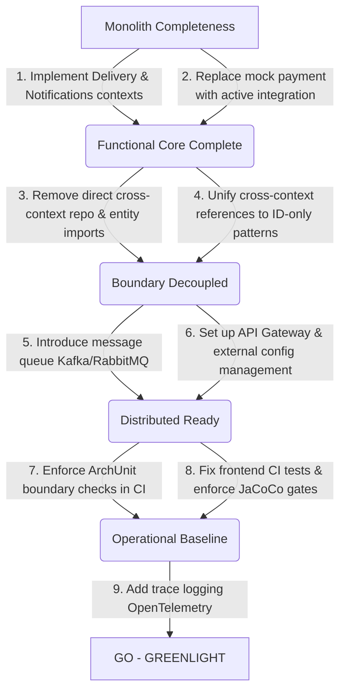

# Burito — Microservices Readiness Assessment

**Date:** 2026-06-23  
**Assessor:** Senior Staff Engineer / Technical Program Manager  
**Scope:** Independent evidence-based audit to determine microservices migration readiness  
**Target Codebase:** [burito](file:///Users/umarkhaji/workspace/mcu/asgard-projects/burito)  
**Status:** Completed (Evidence-Verified)

---

## 1. Executive Summary

Burito is a food delivery platform built as a Spring Boot and React/TypeScript modular monolith. A series of recent refactorings successfully resolved several initial architectural flaws, including restructuring the backend into distinct bounded-context packages (`catalog`, `identity`, `ordering`, `core`), standardizing dates on `LocalDateTime`, unifying Exception handling via `APIException`, dynamic mapping of User roles, and achieving 100% test coverage across core domains. Despite these improvements, **Burito is not ready for a microservices migration.** 

Two of the five planned bounded contexts—**Delivery** and **Notifications**—remain completely unimplemented (existing only as concepts in design documentation). Furthermore, the Ordering context is tightly coupled at compile-time to the Catalog and Identity contexts through direct repository injections (`MenuItemRepo` and `UserRepo`) and cross-context JPA `@ManyToOne` entity relationships. The operational baseline lacks distributed tracing, structured logging, and service registry infrastructure, while CI does not run or validate frontend tests (the frontend job in `ci.yml` is a placeholder). Therefore, starting a microservices migration now is a **NO-GO**. The team must first complete the core product features, break tight compile-time dependencies, and build operational readiness within the safety of the monolith.

---

## 2. Feature Completeness Matrix

| Feature | Backend Status | Frontend Status | Overall Status |
|---|---|---|---|
| **User Registration** | ✅ Complete | ✅ Complete | Complete E2E |
| **User Login / Logout** | ✅ Complete (JWT tokens) | ✅ Complete | Complete E2E |
| **Admin Registration** | ✅ Complete (User + Restaurant creation) | ✅ Complete | Complete E2E |
| **Admin Login** | ✅ Complete | ✅ Complete | Complete E2E |
| **Token Refresh** | ✅ Complete (RefreshTokenService) | ✅ Complete | Complete E2E |
| **User Profile** | ✅ Complete (`GET /api/me`) | ❌ Missing UI | Backend-only / no frontend |
| **Browse Restaurants** | ✅ Complete (List and detail views) | ✅ Complete | Complete E2E |
| **Browse Menu** | ✅ Complete (By category, item cards) | ✅ Complete | Complete E2E |
| **Real-time Menu Updates** | ✅ Complete (WebSocket publisher) | ✅ Complete | Complete E2E |
| **Cart (Authenticated)** | ✅ Complete (CRUD ops) | ✅ Complete | Complete E2E |
| **Cart (Guest)** | ✅ Complete (LocalStorage + Sync on login) | ✅ Complete | Complete E2E |
| **Place Order** | ✅ Complete | ✅ Complete | Complete E2E |
| **Active Order Tracking** | ✅ Complete (WebSocket status push) | ✅ Complete (Real-time page) | Complete E2E |
| **Admin Menu CRUD** | ✅ Complete | ✅ Complete | Complete E2E |
| **Admin Restaurant Profile** | ✅ Complete (Availability toggle, profile update) | ✅ Complete | Complete E2E |
| **Admin Order Dashboard** | ✅ Complete (Real-time order statuses) | ✅ Complete | Complete E2E |
| **Payment Processing** | ⚠️ **Stub** (Logs and returns `true`) | ❌ Missing UI (Checkout button directly places order) | Partially implemented |
| **Order History** | ⚠️ Partial (Retrieve single order only) | ❌ Missing UI | Partially implemented |
| **Delivery Assignment** | ❌ **Not implemented** (Status exists in enum only) | ❌ Missing UI | Missing |
| **Delivery Tracking** | ❌ **Not implemented** | ❌ Missing UI | Missing |
| **Email/SMS/Push Notifications** | ❌ **Not implemented** (WebSocket only) | ❌ Missing UI | Missing |
| **Search/Filter Restaurants** | ❌ **Not implemented** | ❌ Missing UI | Missing |
| **Ratings/Reviews** | ❌ **Not implemented** (Static seed rating exists) | ❌ Missing UI | Missing |
| **Address Management (User)** | ❌ **Not implemented** (Address only on Restaurant) | ❌ Missing UI | Missing |
| **Coupon/Discount System** | ❌ **Not implemented** | ❌ Missing UI | Missing |

---

## 3. Architectural Consistency

### 3.1 Bounded Context Restructuring
The backend has been restructured from a technical-layer layout into distinct domain packages:
- `com.burito.catalog` (Restaurants and menu items)
- `com.burito.identity` (Users, authentication, token services)
- `com.burito.ordering` (Carts, orders, stub payment)
- `com.burito.core` (WebSockets, openAPI, security, global exception handlers)

While this package separation is a solid step forward, compile-time dependencies still cross these packages, violating clean service boundaries.

### 3.2 Cross-Context Compile-Time Coupling
The **Ordering** context relies heavily on Catalog and Identity persistence layers:
- **Direct Repository Imports:**
  - `CartService.java` directly imports and injects [MenuItemRepo](file:///Users/umarkhaji/workspace/mcu/asgard-projects/burito/backend/src/main/java/com/burito/catalog/repository/MenuItemRepo.java) and [UserRepo](file:///Users/umarkhaji/workspace/mcu/asgard-projects/burito/backend/src/main/java/com/burito/identity/repository/UserRepo.java) to fetch domain objects:
    ```java
    import com.burito.catalog.repository.MenuItemRepo;
    import com.burito.identity.repository.UserRepo;
    ```
- **Tight JPA Entity Coupling:**
  - `Cart.java` maintains a `@ManyToOne` relationship pointing directly to the `User` class in the Identity context:
    ```java
    import com.burito.identity.domain.User;
    @ManyToOne(fetch = FetchType.LAZY)
    private User user;
    ```
  - `CartItem.java` maintains a `@ManyToOne` relationship directly with the `MenuItem` class in Catalog:
    ```java
    import com.burito.catalog.domain.MenuItem;
    @ManyToOne(fetch = FetchType.LAZY)
    private MenuItem menuItem;
    ```
- **Inconsistent Reference Patterns:** 
  - `OrderItem.java` correctly references the menu item via a loose ID-only `Long menuItemId` pattern.
  - `CartItem.java` incorrectly uses a tight JPA entity mapping to `MenuItem`. This inconsistency violates domain boundary rules.

### 3.3 Controller Layering and WebSocket Integration
Controllers no longer query database repositories directly. However, an architectural concern remains in how WebSocket notifications are triggered:
- [OrderController.java](file:///Users/umarkhaji/workspace/mcu/asgard-projects/burito/backend/src/main/java/com/burito/ordering/controller/OrderController.java) and [AdminOrderController.java](file:///Users/umarkhaji/workspace/mcu/asgard-projects/burito/backend/src/main/java/com/burito/ordering/controller/AdminOrderController.java) directly inject `SimpMessagingTemplate` and execute WebSocket broadcasts after order placement/updates. 
- *Correction needed:* Service-related side-effects (like broadcasting events) should be pushed down to the Service layer rather than polluting controllers.

### 3.4 Consolidated Exception Handling
Exception handling has been successfully standardized:
- The [GlobalExceptionHandler](file:///Users/umarkhaji/workspace/mcu/asgard-projects/burito/backend/src/main/java/com/burito/core/controller/GlobalExceptionHandler.java) uniformly handles `APIException` structures.
- It also maps generic `IllegalArgumentException` and `IllegalStateException` throws into standard `APIResponse.error` packages.
- Competing exception patterns (such as raw `ResponseStatusException` in Catalog) have been fully refactored to extend `APIException`.

### 3.5 Foundational API Responses, Dates, and Roles
- **Response Wrapping:** All controller responses—including administrative routes—now consistently wrap outputs in the generic `APIResponse<T>` envelope.
- **Dates/Times:** Standardized on `LocalDateTime` across all entity classes. `Restaurant.createdAt` was successfully converted from `LocalDate` to `LocalDateTime`.
- **Dynamic Roles:** `UserService.loadUserByUsername()` dynamic mapping is fully functional.

### 3.6 Dead Weight & Security Anomalies
- **Dead Weight:** The enum [CartStatus](file:///Users/umarkhaji/workspace/mcu/asgard-projects/burito/backend/src/main/java/com/burito/ordering/enums/CartStatus.java) contains a `BOOKED` value that is never used. Similarly, 11 of 15 values in `CuisineType` (like `ETHIOPIAN`, `CARIBBEAN`, `GREEK`) are never referenced by seed data or frontend logic.
- **Security:** WebSocket configuration has CORS wildcarding set to `*` (`allowedOrigins = "*"`), which represents a high risk in production.

---

## 4. Data, Integration, and Workflow Gaps

- **Seed Data:** Highly realistic and diverse seed data (including 4 distinct restaurants and 27 categorized menu items with pictures and promotional pricing) is maintained through Flyway migrations.
- **Flyway Migrations:** 13 sequentially numbered Flyway files (V1 through V13) exist with zero gaps. The schema correctly implements guest carts, UUID primary keys, and admin authentication parameters.
- **Integration Gaps:**
  - **Payment:** `PaymentService.java` remains a complete stub that logs and automatically returns `true`. No transactional safety or payment gateway exists.
  - **Delivery Bounded Context:** Absolutely no delivery service, entity, database table, or matching logic exists. Manual status overrides on the admin dashboard (`OUT_FOR_DELIVERY` / `DELIVERED`) are the only placeholders.
  - **Notifications Bounded Context:** No email service (SMTP/SES) or SMS integration exists. Real-time updates occur solely through transient active WebSocket connections.

---

## 5. Test and CI Health Summary

### 5.1 Test Pyramid
- **Backend Tests:** ~123 tests total (~72 Unit tests using JUnit & Mockito, ~50 sliced Controller tests using `@WebMvcTest`, and 1 `@SpringBootTest` context load verification with PostgreSQL Testcontainers). 
- **Coverage Quality:** Excellent backend coverage. Core domains (Identity, Catalog, Ordering) maintain high coverage, ensuring that current logic paths are thoroughly validated.
- **Frontend Tests:** ~44 component tests total (running on Vitest + Testing Library). 
- **Critical Gaps:** No End-to-End (E2E) UI testing setup (Cypress/Playwright) exists. There are zero integration tests testing the full HTTP request-response flow from controller to database.

### 5.2 CI Pipeline Gaps
The GitHub workflow [ci.yml](file:///Users/umarkhaji/workspace/mcu/asgard-projects/burito/.github/workflows/ci.yml) has major limitations:
1. **Frontend CI is a Placeholder:** The `frontend` step in CI simply executes `test -f frontend/index.html` to check that the index file exists. **None of the 44 Vitest frontend tests are run in CI.**
2. **No Coverage Gates:** While JaCoCo reports are compiled and uploaded as build artifacts, there is no `jacocoTestCoverageVerification` step. As a result, code changes can drastically reduce test coverage without failing the CI pipeline.
3. **No ArchUnit Gates:** Clean separation of packages is not enforced via ArchUnit. There is no automated block preventing developers from introducing new cross-context imports.

---

## 6. Microservices Readiness Scorecard

| Readiness Signal | Score | Evaluation & Evidence |
|---|---|---|
| **Bounded Context Decoupling** | 🔴 **Not Ready** | Domain package restructuring has occurred, but compile-time dependencies remain. Services directly inject repositories belonging to other contexts, and JPA mappings tie `Cart` and `CartItem` directly to `User` and `MenuItem`. |
| **Database Separability** | 🔴 **Not Ready** | Shared database with cross-context foreign keys (e.g., `cart_item` pointing directly to `menu_item`, `orders` pointing to `users`). Database schemas cannot be cleanly divided without breaking integrity checks. |
| **Communication Decoupling** | 🔴 **Not Ready** | No message brokers (RabbitMQ/Kafka) or HTTP client layers exist. All context interaction occurs via synchronous direct service method calls or database joins. |
| **Feature Completeness** | 🔴 **Not Ready** | Two entire contexts (Delivery, Notifications) are absent, and Payment is a hardcoded stub. You cannot distribute a system when its primary business workflows are missing. |
| **Operational Observable Baseline** | 🔴 **Not Ready** | Spring Boot Actuator is configured but only exposes basic health info. There is no metrics aggregation, correlation tracing, or centralized logging. |
| **Operational Infrastructure** | 🔴 **Not Ready** | The infrastructure is single-container shaped. No API gateways, config servers, or service discovery setups exist. |
| **Test Confidence for Refactoring** | 🟡 **Partial** | High unit and slice test coverage exists, but the lack of E2E tests and frontend validation in CI means there is no safety net for distributed flow changes. |
| **Configuration Maturity** | 🔴 **Not Ready** | Single `application.yaml` with no profile separation (e.g., dev/staging/prod). Dynamic secrets are loaded from `.env`. |
| **CI/CD Maturity** | 🔴 **Not Ready** | CI only builds and runs backend unit tests. No automatic frontend test execution, no coverage thresholds, and no CD automated pipelines exist. |

---

## 7. Recommendation: NO-GO on Starting Microservices Migration Now

### Final Verdict: 🔴 NO-GO

### Reasoning
While recent codebase cleanup has greatly improved modularity, starting a microservices migration right now is a **NO-GO** for three major reasons:
1. **Incomplete Core System:** Delivery and Notifications are missing, and Payment is a mock stub. Splitting the monolith now means building missing, complex core flows in a distributed architecture from scratch, which drastically increases debugging and synchronization overhead.
2. **Tight Compile-Time Coupling:** Ordering services and entities are heavily bound to Identity and Catalog. Extracting these into separate network-connected nodes would require immediately replacing JPA mappings with distributed data patterns (like sagas and IDs) while in a state of flux.
3. **Zero Distributed Infrastructure:** The application has no message broker, service discovery, distributed tracing, or deployment pipeline. Running microservices without this infrastructure is an operational nightmare.

### What Needs to Be True to Flip to GO

To greenlight a microservices migration, the codebase must meet the following gates:



1. **Complete Missing Features:** Implement Delivery and Notifications contexts to MVP level, and replace the mock payment stub with a real payment integration (e.g., Stripe, PayPal, or sandbox API).
2. **Untangle the Codebase Boundaries:**
   - Remove direct repository injections across domains (e.g., remove `MenuItemRepo` and `UserRepo` from `CartService`).
   - Replace direct JPA entity mappings (`@ManyToOne`) between contexts in `Cart`, `CartItem`, and `Order` with ID-only `Long` or `UUID` references.
   - Restrict cross-context interactions to service interfaces or events.
3. **Decouple Communications:** Add a message broker (like RabbitMQ or Kafka) to support asynchronous event-driven integrations (e.g., `OrderPlacedEvent` triggering payment and delivery flows).
4. **Deploy Operational Tooling:** Introduce an API Gateway, spring-cloud-config (or similar externalized configuration), and distributed trace logging (e.g., OpenTelemetry / Spring Cloud Sleuth).
5. **Harden Build Gates:**
   - Add ArchUnit tests to the backend to block compilation if illegal cross-context imports are introduced.
   - Update `ci.yml` to run the 44 frontend Vitest tests on every pull request.
   - Enforce a minimum JaCoCo code coverage gate (e.g., 85%) on pull requests.
